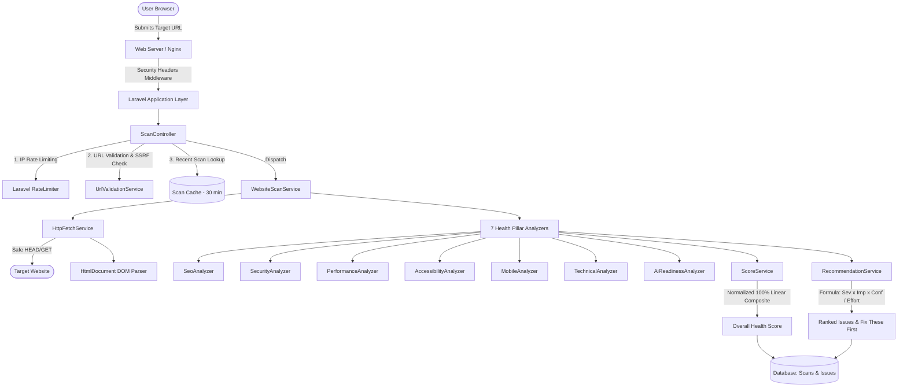

# W3HealthChecker — System Architecture Documentation

## 1. System Overview

W3HealthChecker is an enterprise-grade Website Intelligence SaaS engineered to passively audit, score, and provide actionable recommendations across 7 core website health pillars:

1. **Technical & On-Page SEO (20%)**
2. **Defensive Security & SSL (20%)**
3. **Performance & Document Hygiene (15%)**
4. **Accessibility Indicators (15%)**
5. **Mobile Readiness (10%)**
6. **Technical Infrastructure (10%)**
7. **AI & Search Readiness (10%)**

The platform emphasizes **defensive-only inspection**, strict SSRF protection, transparent scoring formulas, and actionable step-by-step fix recommendations.

---

## 2. Technical Stack

- **Backend Framework:** Laravel 11.x (PHP 8.2+)
- **Frontend Layer:** React 18 with Vite 5 bundled SPA
- **Styling:** Tailwind CSS 3.4 with custom glassmorphism and curated dark mode palettes
- **Database:** SQLite (development / test) / MySQL or PostgreSQL (production)
- **Queue Pipeline:** Laravel Database Queue / Redis Worker
- **Testing:** PHPUnit 11 with custom local HTML fixtures and mock networking

---

## 3. Component Architecture & Data Flow

---

## 4. Key Architectural Decisions

1. **Passive Inspection Exclusively:**
   No invasive probing, brute force, exploit execution, or credential fuzzing is performed. All audits inspect publicly delivered HTML and HTTP headers.
2. **Deterministic Multi-Factor Prioritization:**
   Issues are prioritized via:
   $$\text{Priority Score} = \frac{\text{Severity Weight} \times \text{Impact} \times \text{Confidence}}{\text{Effort}}$$
   This ensures high-impact quick fixes surface to the top of "Fix These First".
3. **Transparent Methodology:**
   Every finding explains:
   - What is wrong
   - Why it matters
   - Where the problem is
   - How to fix it (with code snippets)
